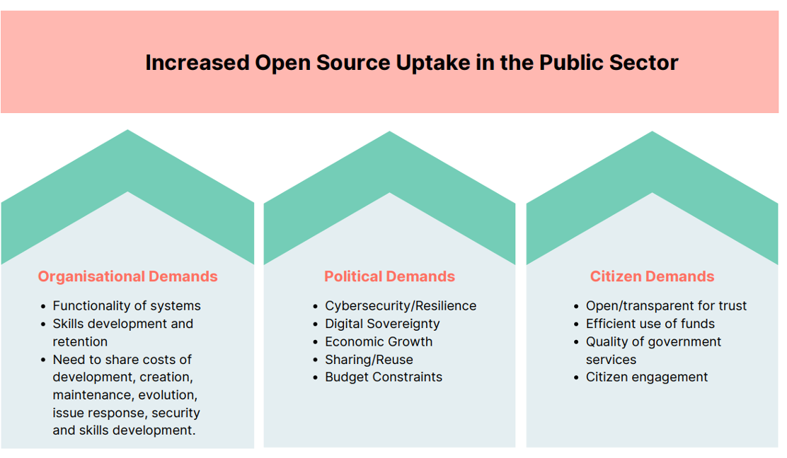
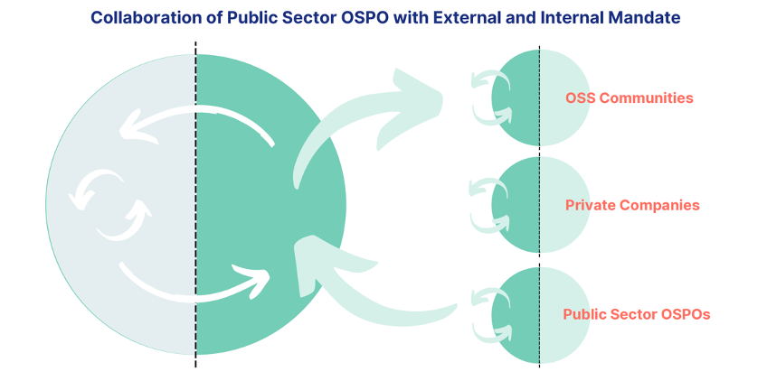

# OSPO——数字化政府的新工具

:::tip Info

**译者：**

* 赵海玲 开放原子开源基金会行业研究员
* 梁婷婷 曾任开放原子开源基金会实习生
* 王铭典 曾任开放原子开源基金会实习生

**审校：**

* 李建盛 开放原子开源基金会资深顾问
* 金思含 开放原子开源基金会助理开源项目运营官
* 郭雪雯 开放原子开源基金会法律顾问

:::

### 欧洲开放论坛

欧洲开放论坛（OFE）是总部位于布鲁塞尔的非营利性独立智库，它向欧洲各地的政策制定者和共同体组织讲述计算开放性的优点。

OFE最初发起于2002年，旨在促进和扩大企业、消费者和政府对开源软件（OSS）的使用，此后其关注领域不断拓展。OFE目前在布鲁塞尔设有一支政策研发团队（Policy Research and Development team），该团队由我们的支持者联络网和专门的专家顾问提供支持。我们的主要政策主题覆盖：开源、开放标准、数字化政府、公共采购、知识产权、云计算和互联网政策。

OFE还拥有由开放论坛学院研究员（OpenForum Academy Fellows）组成的独立全球联络网，每位研究员都在核心主题上贡献了重要的创新思维领导力，以对影响ICT市场开放性的关键问题提供新的意见和见解。OFE直接或通过其国家伙伴与欧盟委员会、欧洲议会、国家和地方政府密切合作。

### OSPO联盟

OSPO联盟（The OSPO Alliance）由多家欧洲的非营利性组织（OW2、Eclipse基金会、欧洲开放论坛和公共代码基金会）及相关个人在2021年6月发起，旨在丰富管理开源软件的优秀方法。我们一起创建了OSPO.Zone——一个开放的经验共享平台，以促进对于工具和最佳实践的探索，并帮助定义该领域的最新技术。

OSPO联盟旨在为所有愿意就开源软件的使用、贡献和发布进行专业化管理的组织提供可操作的指引和解决方案，不论组织的规模、收入模式，也不论其在公立还是私立领域。特别是，它将帮助这些组织在其信息系统与流程中充分利用开源软件势不可挡的进步性。使用开源软件将促进工具和最佳实践的发现和实现。

通过对开源软件进行专业化管理，OSPO联盟将降低使用开源软件的风险，并提高可预测性。它将降低使用开源的障碍，并促使组织可利用它来增强其数字主权。

## 前言及背景

各级政府（地方、市、地区、国家和超国家的）都显现一种明确的趋势，即以战略的视角思考开源，以实现更宏伟的目标。开源在技术领域无处不在，这证明、甚至要求大多数数字使能的公立领域就开源采用更为积极、更为广泛的方法。

由于各级政府机构希望更大程度地吸引公民参与，更有效地利用纳税人的资金，并在本土背景下解决全球挑战，开源软件战略方法的价值更为凸显。公立领域和政府数十年来持续采购、使用和贡献开源，政府中开源项目办公室（Open Source Program Office）的兴起，更有望支持公立领域以最佳方式利用其与开放共同体在软件、标准、数据、文化、研究等方面的合作。

精通开源的政府首席信息官（CIO）和IT部门不断意识到，当他们提高其参与、贡献项目与开源共同体的能力时，其可以通过开源而实现的价值就会急剧增加。因此，越来越多的政府CIO选择开源计划办公室（Open Source Program Office）并将其作为提升其组织来满足新旧诉求的能力的工具。

开源项目办公室（OSPO）是一个支持和促进消费、创建和应用开源软件的机构性组织构架。OSPO是一个机构的重心以及开源能力中心，其从战略上实现该机构与开源相关的政策目标。

本文探讨了将OSPO引入公立领域的早期尝试。本文将讨论开源在政府战略背景下的发展，参与开源共同体的价值，以及OSPO在提供专业知识和联系方面对于彰显全球化协作及共同创造的价值的潜在作用。本文认为OSPO是一个多面工具，其用于解决不同公立领域的高管在不同角色中所面临的挑战，并满足这些高管使用开源软件（OSS）的诉求。因此，本文主题是公立领域的组织化能力建设。

下述案例研究是基于对公立领域OSPO领导者的采访，并调研他们为什么以及如何建立OSPO。这些案例研究概述了不同OSPO的责任及活动，并探讨了OSPO实现一系列政策目标的潜力。

建立OSPO的趋势是对数字化政府所面临的更广泛趋势的回应。公民和政客要求提供更开放、更负责任和更容易获得的高质量服务。他们要求在严格的预算限制下实现这一目标，同时保持数字主权、系统韧性及网络安全。开源在这个不断变化的环境中扮演着重要的角色，且OSPO是政府CIO利用开源软件满足诉求的工具。对于这些复杂挑战，OSPO是数字化政府应对这些复杂问题的新工具。

在私立领域建立OSPO对于大规模创新和共同创造必不可少。建立OSPO后，企业已经找到了如何通过开源释放大量价值从而让全球股东受益的方法。本文发现，公立领域的价值立场与之密切相关，但又本质上不同。

本文还探讨了现代OSPO的职权。它需要在开源软件的合规性、安全性和治理方面上提供内部价值。

至关重要的是，应为OSPO创建具有与外部开源生态系统进行交流及合作的职权。它需要成为一个接口，支持和管理整个组织与外部利益相关者之间在信息、思想、软件贡献、关系及采购活动上的交流。

本文的目的不是概述各级政府CIO所面临的各种挑战和障碍的解决方案。相反，本文的主要结论是，OSPO的建立是为了给政府CIO在软件产品和服务方面提供务实的选择、灵活性和控制权，反过来又使他们能够更好、更有效地满足对其提出的各种复杂诉求。

## 报告结构和定义

这篇报告可以看作是欧盟委员会发布的开源对欧盟经济的影响报告——“开源软件和硬件对欧盟经济的技术独立性、竞争力和创新的影响”的后续，其中包括支持在欧盟公立领域和学术界中建立20个OSPO的政策建议。

在公立领域建立OSPO是一项飞速政策创新。为了介绍这一领域的情况，本文自由穿梭于当下的实践和理论之间；OSPO是什么以及它能成为什么。本文并未呈现组织化的模式、标准方法或“最低可行的OSPO”，而这将是后续报告的主题。

开源产品和服务的采购也并非本文重点。OSPO将在有效的开源采购中扮演重要（甚至是关键的）角色，但是对于那些仍在争论是否要采购开源的组织来说，建立OSPO就不那么重要了。正在建立OSPO的组织往往已经超越了仅将开源用于节省成本的旧模式，而是着眼于他们的战略方法，以实现价值、创新和灵活性的最大化。

我们所说的“开源软件”，是指在开放源代码促进会（Open Source Initiative）批准的许可证下的、符合开源定义的软件；简单来说，用户可以访问、修改并改进源代码。

本文多处提到“共享与复用”。对此，我们指的是任何人都可以访问源代码，根据需要进行修改，并通过重新发布这些改进以供人们使用。

本文交替使用“公立领域”、“政府组织”、“公共实体”和“公共机构”，这样做是为了强调OSPO概念与全部或部分由国家控制的所有经济部门广泛相关。

同样，本文所说的“政府CIO”指的是公立领域的组织中为支持组织和政治目标而负责信息技术和计算机系统的职位。这包括首席数字信息官（CDIO）或IT部长等角色。他们将是负责建立OSPO的最高级的管理人员。

最后但同样重要的是，作者要感谢支持本文撰写的专家组：

> Bastien Guerry, Government of France
> Clare Dillon, InnerSource Commons Foundation & OSPO++
> Danese Cooper, InnerSource Commons Foundation & OSPO++
> Deborah Bryant, Independent Advisor & Open Source Initiative Board Emeritus
> Frederik Blachetta, Dataport
> Gaël Blondelle, Eclipse Foundation
> Gijs Hillenius, European Commission
> Jacob Green, Mosslabs.io, OSPO++
> Jacob Green，Mosslabs.io，OSPO++
> James Vasile, Open Tech Strategies
> Johan Linåker, RISE Research Institutes of Sweden
> Leslie Hawthorn, Red Hat & Open Source Initiative Board Emeritus
> Mala Kumar, GitHub
> Michael Plagge, Eclipse Foundation
> Miguel Diez-Blanco, European Commission
> Philippe Bareille, City of Paris
> Richard Littauer, Open Source Collective and Sustain
> Sayeed Choudhury, Johns Hopkins University & OSPO++

## 公立领域与开源

城市与国家政府的诉求往往有所不同。税务机关与超国家组织（例如欧盟）也有着不同的授权。公立领域采购、使用和部署开源解决方案的原因是多方面的，很难像公立领域这种宽泛的领域一概而论。但是，无论是有意还是无意，所有公立领域的组织都在使用开源软件。公立领域早期使用开源的应用程序和工具通常是为了完成没有资金支持的政策职权（即，需要完成一个新项目或达成新能力，但没有相关预算）以及减少采购摩擦而做出的一种机敏的反应。

出于战略目的使用开源的原因在于，在开源软件许可证下的软件易于检查、互操作、共同创造，具有扩展性、可持续性和可定制化，而专有的解决方案无法提供这些优势。例如，如果你有6万所学校需要软件解决方案，那么为开发与支持软件而提供资金比为每所学校支付许可费要更佳。公立领域使用开源的原因有（但不限于）：

* 透明度与信任
* 节约成本
* 避免软件供应商锁定
* 增加采购过程中的中小企业
* 互操作性
* 公民参与
* 减少政府内部和政府之间的合作摩擦
* 利用最先进的技术
* 提高政府组织的能力和技能
* 吸引并留住人才
* 行业和政府组织合作的新兴方式

在“开源”这个词被创造出来之前，公立领域就已经使用开源了。以本文提到的组织为例，在2000年12月，欧盟委员会就制定了一项关于内部使用开源软件的战略。巴黎市参与开源也已超过了20年。2002年，巴黎市议会投票决定开启Lutece平台，这也是巴黎开始参与开源的一个关键时间点。

> 译者注：Lutece是由巴黎市开发的基于BSD开源的平台，可帮助您开发数字解决方案。经过近二十年为城市使用的打磨升级，Lutece现已发展成为拥有400多个插件和模块化架构的多方面平台，可满足您的特定诉求并增强用户的数字体验。

正常情况下，公立领域对于开源的理解和对开放范式的实践情况因国家、机构和行政水平而异。有些公立领域和国家对开源有非常充分的了解和较高的追求。它们将开源视为一个非常重要的工具，来帮助他们实施更广泛的数字战略，并聚焦在维护主权与安全的同时实现数字转型。其他的公立领域和国家则刚刚开始它们的开源历程。

在下述案例研究中将探讨开源参与度上升的原因，但理解这种发展的方式之一是基于开源对CIO所提新诉求的视角，通常不同的战略文件会对这些诉求进行概述。

例如，欧盟委员会的开源软件战略概述了战略性政治原因，具体表述如下：“欧盟委员会旨在振兴欧盟独特的社会市场经济，促进竞争和鼓励作为“我们的创新者和企业家”的中小企业。我们希望以包容、开放的方式将欧洲人民团结在一起，去寻找新的机会，向更包容、更好的数字环境过渡，为当今全球经济的发展做好准备。在这些目标中，开源软件都可以发挥作用。”

下图总结了公立领域使用开源的一些诉求。

可以说，由于上面列出的诉求，公立领域使用开源的趋势有所增加。值得注意的是，每个诉求的重要性（这个列表远没有详尽列举）将因国家、政府组织形式和参与开源的历史而异。

在对CIO提出的诉求中，存在5个突出的战略要素。

### 数字主权

数字主权的概念是多个司法管辖区关于数字政策辩论中的关键议题之一，原因在于政府已经意识到对某些软件解决方案的过度依赖及有限数量的供应商的能力。开源，特别是当它与基于开放标准的采购流程结合时，它为公立领域的采购机构提供了真正的选择，并避免了供应商锁定。这并非一个新认知，但从战略角度来看，整个社会的高度锁定破坏了数字主权。该诉求由政治层面推动。

### 经济增长

公立领域不能有效使用开源软件所付出的代价，不仅造成更高的货币成本、更低的竞争、不灵活的系统和锁定，还有存在于经济增长中巨大的机会成本。欧盟委员会关于开源对欧洲经济的影响研究概述了政府发布、使用和贡献开源软件带来了经济增长、就业和初创企业等方面巨大的（大部分并未实现的）积极经济外部效应。Frank Nagle关于法国政府决定发布更多代码所做的研究结果也印证了这点，他发现，“这项规定导致使用开源软件的企业每年增加0.6%-5.4%，与IT相关的初创企业数量每年增加9%-18%，从事IT相关工作的人数每年增加6.6%-14%。”该诉求也日益由政治层面推动。

### 跨境中的互操作性与跨部门公共服务

开源，特别是当它与开放标准一起使用时，它为公立领域提供了更多的机会来协调相邻国家之间的服务。这种互操作性也使公立领域能够利用最优秀的人才来解决问题，而不受地理位置的制约。最后，代码的共享、复用及修改将减少改进或创建公民服务/后台应用程序所需的时间。

### 政府数字服务的透明度和负责度

开源并不是信任和透明度的灵丹妙药，但它增加了公民检查、交互组成数字服务的代码的能力。该诉求由公民自身和政客推动。为了实现数字化政府的承诺，公民必须信任被提供的服务。总体而言，社会趋势正在使得对于公民参与度、中小企业参与度以及提高政府运作透明度和负责度的诉求增加，数字服务也是如此。

### 技能和人才招募

所有组织（无论是在私立领域还是公立领域）都在努力寻找技术人才。在私立领域，开源已经陡然发展，因其允许开发团队（并通过扩展到企业）分担开发、创建、维护、发展、问题响应、安全和开发技能的成本。此外，开源是开发者的首选，因为在他们交付高质量代码的同时，开源提高了他们更快速地迭代解决方案从而解决技术难题的能力。

## OSPO的深入解析

随着人们对开源软件和当今的CIO的诉求越来越大，OSPO迎来了发展机遇。对开源软件的诉求已远远超出了开放代码的范围，该诉求延伸到组织文化、对开放性和透明度的承诺，以及最重要的合作方面。当我们谈及数字政策与软件，我们谈论的是开源。它是数字世界的基础创新层。对于CIO来说，OSPO是他们的组织与该层之间的接口。

OSPO是私立领域的既定概念。当前，越来越多的学术和政府部门也在设立OSPO。OSPO是一种制度性组织结构，它支持并促进消费、创建与应用开源软件。它是机构中的中心办公室，致力于实现该机构与开源相关的政策目标。

根据其部门、规模和类型的不同，组织的开源目标也会有所不同。各组织建立OSPO是为了实现这些目标，因此所有的OSPO各不相同。

在私立领域建立OSPO，对于找出如何通过开源释放大量价值并刺激创新从而使全球股东受益的方法来说至关重要。OSPO的兴起是今天开源无处不在的直接结果。事实上，92%的应用程序都使用了开源组件。

企业建立OSPO是为了提供必要的能力、技能及共同体参与，以便其以有意义的方式成为开源生态系统的组成部分。OSPO回应了如下认知：使用开源不再是一项选择，而是必需。

大型企业已经在学习并采用开源开发所特有的流程及方法上投入了精力与资源。

私立领域OSPO的大多部门都能适用于政府，而政府OSPO可以（也应该）开展更宽泛的工作。因为公立领域对公民的责任比企业对股东的责任更大。从这个角度看，OSPO一方面可以推动开源目标的实现，另一方面也可以满足需要开源的更宽泛的政策目标。

换句话说，OSPO的职权应该包括软件开发和维护的日常事务，但它可以（或也应该）支持实现全面的政策目标，如隐私、安全、认证、多样性、公民参与及技术获取。

以前的OSPO是专注于内部的，现代OSPO则有明确的内部和外部职权。下文的概念图基于OSPO++联络网的工作模型，显示了OSPO是组织与其他同行OSPO及开源生态系统中（及之外）的其他人的协作接口。

### 内部职权

OSPO对组织有一个横向的展望，使其可以有效地利用现有资源。下文列举了在OSPO内部职权范围内的活动实例，包括实现开源软件开发的最佳实践和网络安全所需的适当工具、平台和实践。此外，OSPO的内部职权支持了组织内部开放文化的发展，这超越了软件和数字基础设施建设的层面。它是作为文化变革的工具而建立的。欧盟委员会的OSPO明确发挥了这一作用，微软的OSPO可以被视为“OSPO文化变革”的私立领域例子。

在OSPO内部职权内的活动实例包括：

* 确保合法合规
* 制定和实施开源软件战略
* 帮助启动新软件项目的团队更好地使用开源
* 数字化合作战略
* 衡量组织对开源软件的使用和进展（指标和统计数据）
* 为开源软件制定募资方案
* 为员工提供培训和指导，让他们了解如何参与开源软件活动
* 在内部宣传和交流有关开源的倡议，以及组织参与开源的任何其他活动。

### 外部职权

OSPO需要在内部职权下为其服务的组织提供直接价值。然而，由于开源的本质，启用OSPO的组织意味着成为共同创造价值的共同体的一部分。因此，现代OSPO有一个重要的外部职权，即确定新的项目、工具、行动者和实践，从而改善OSPO和整个组织的工作、效率和未来战略。正如案例研究所示，政府官员和OSPO参与者经常认为这一外部职权是OSPO在支持组织方面的最关键特征之一。

另一方面，当外部开源开发者和项目想与公立领域的组织进行开源合作时，往往会面临一个挑战：如果他们想讨论一个潜在的解决方案，或者不确定与政府管理的数字解决方案有关的许可问题，那么他们该与谁联系？这可能而且应该超越了代码层次。OSPO便可以提供这样一个接口：为其他政府官员、开发者和开源项目，以及为国内和全球的其他OSPO提供一个入口。

当涉及到组织的日常活动时，政府OSPO的外部职权可以协助组织在政策、采购、IT和供应商以及在采购过程中合作的其他公共组织之间进行沟通与翻译。这在市政一级尤为重要和明显。

采购将激活内部和外部职权。可以说，这将是OSPO能为公立领域的组织带来的最大货币价值。OSPO的建立增加了支持有效采购开源软件产品和服务的能力与资源。OSPO可以帮助确定开源替代方案，根据诉求和规范评估产品和服务，评估开源软件项目的健康和安全，计算所有权的总成本，并确定定制化与集成的需求。

在OSPO外部职权内的活动实例包括：

* 安全、可持续地接受和提供外部代码贡献
* 对外宣传及交流有关开源的倡议，以及组织参与开源的任何其他活动
* 与基金会/组织和开源共同体开展合作
* 提供对开源领域已开发的替代方案的认识及认知，以避免不必要的重复
* 管理生态系统中开源利益相关者的多样性
* 支持开源软件产品和服务的采购
* 实现软件的共享和复用

**一个重要的改进点是：作为接口的OSPO不应该创建额外的官僚阶级，它应该是一个推动者。换句话说，不是所有事情都需要通过OSPO。**

政府OSPO支持组织内部以及整个组织与外部利益相关者之间的代码、思想、采购活动、信息和知识的交流，它是一切“开放”的通用接口。私立领域花了几十年的时间来构建OSPO的内部和外部职权，对政府来说，其任务更明确，即是合作而非竞争，这应该是理所当然的事情。

## 公立领域OSPO的案例研究

### 欧盟委员会OSPO

欧盟委员会宣布将于2020年10月建立一个OSPO（EC OSPO）。这是其2020-2023年开源战略介绍的一部分。欧盟委员会将开源战略的这一迭代公布为“委员会通讯文件”，使其成为整个欧盟委员会的战略，而不仅仅是IT总署的战略。这也使OSPO获得了更强的政治任务。

EC OSPO致力于实现开源战略中概述的愿景及目标：“欧盟委员会利用开源的变革、创新和协作能力，鼓励软件解决方案、相关知识和专业知识的共享和复用，从而提供更好的欧盟服务，丰富社会并注重降低社会成本。”

EC OSPO是欧盟委员会内部文化变革的一个工具。它的作用是“加强和扩大开源文化”。它隶属于“信息总署”，但旨在支持所有的总署，并在政治和组织上得到支持来这样做。这是因为软件的开发、使用和普及涉及整个机构。OSPO应该在这些团队和项目之间开展工作，使欧盟委员会所开发的源代码可供所有的开发团队使用。这项工作首先在欧盟委员会内部进行。目前，OSPO正在努力消除已识别的法律和技术障碍，以便欧盟委员会在OSPO的支持下公开提供更多的解决方案。

欧盟委员会希望利用OSPO为自己做好准备，逐渐接受来自组织外的开源贡献，并开放面向更广泛的合作。以上贡献与合作都可以超越代码层面。OSPO和该战略还承诺积极支持欧盟委员会之外的开源开发者共同体。实际上，OSPO的目标是连接和参与开源共同体和项目，特别是那些为欧盟委员会所依赖的工具做出贡献的共同体及项目，例如Drupal案例。

> 译者注：Drupal是开源软件，目前由超过63万使用者和开发者共同维护和持续开发。Drupal遵循GNU通用公共许可协议，每个人都可以免费下载、分享使用。在这种开放的开发模式下，开发者可以持续引进网络发展中的最新技术，使Drupal成为技术领先的平台。Drupal的原则是鼓励模块化、标准化、合作、易用性等。Drupal共同体提供支持的方式多种多样——聊天工具、论坛、在Drupal大事件期间面对面交流。共同体还为Drupal创建了文档，涉及到使用Drupal的主要话题。Drupal全球共同体引领着各项创新，使Drupal越来越被网络开发者和站长们偏爱。每个人都可以参与到Drupal共同体中来，并作出贡献。

EC OSPO表明，一个政府的OSPO不必规模庞大或成本高昂，也能产生影响。欧盟委员会约有32000名员工，OSPO最初的团队只有两个人。随后，欧盟委员会加强了OSPO，新聘人员带来了更多机构管理的知识和能力，其主要职责是在组织方面发展EC OSPO。

在欧盟委员会20年来不断加大开源方面的工作下，EC OSPO顺理成章的成为下一阶段的工作。尽管如此，该战略的制定者对在欧盟委员会内设立OSPO仍有大量考虑，这个想法已经在该机构与开源关系最密切的官员中流传了数年之久。成立前的一个关键过程是由外部咨询企业对欧盟委员会的开源治理和采用情况进行调查。在这项调查中，OSPO的成立建议是通过与私企、政府和民间社会组织的对话中达成的。更具体地说，它建议成立一个作为“企业管理的最先进结构”的EC OSPO。这是基于法国国家层面的政府和谷歌的开源计划办公室所采取的举措。

### 法国政府OSPO

和欧盟委员会一样，法国政府长期支持推广和使用开源。多年来，它在公立领域实施了若干支持开源软件的政策，例如，5608号通函（Circulaire 5608）要求所有公立领域在采购时首先考虑开源。法国政府OSPO成立的契机是2020年Bothorel报告的发布。这份文件是法国议会的成果，它建议设立一个国家级OSPO。2021年，公共转型与民事服务部部长宣布成立OSPO，并宣布一系列在公共行政部门内推广、采用和改进开源软件的行动。

新OSPO （Pôle d 'expertise logiciels libres/自由软件专家中心）是首个为国家政府设立的此类机构之一。它隶属于跨部委的数字总署（DINUM），因而支持法国政府的所有部门。与EC OSPO类似，法国政府OSPO从一份开源战略文件“Plan d’action logiciels libres et communs numériques/自由软件与数字共同体的行动计划”中获得授权。简而言之，法国OSPO致力于提高公立领域对开源软件的认知、使用及发展。

法国政府OSPO的一个重要既定目标是增强作为雇主的公立领域对具有数字技能的青年人才的吸引力。它通过与法国政府的开源开发者共同体“Blue Hats”合作，组织年度“自由与开源冲刺”活动，同时也通过使用开源本身来实现这一目标。因为开发人员和软件工程师不太可能选择让其使用和贡献开源能力受限的工作。

OSPO将参与几项宏伟的计划。例如，政府投入3000万欧元资助地方政府的开源解决方案。在开发方面，它将与法国网络账号联通平台FranceConnect合作公布平台的源代码。此外，它将运行开发code.gov.fr网站（也有英文版本）。它还推出了“BlueHats代码学期（BlueHats Semester of Code）”项目，软件工程专业的学生将贡献开源软件6个月。

建立联络网对国家OSPO具有特别重要的意义。法国OSPO团队表示，他们不能忽视在城市、市政机关、大学和其他组织所做的工作。这些经验带来了一个重要的观点：OSPO的参与确保了资源的有效配置、创新及改善。因此，有必要在中央OSPO和不同的机构/组织之间建立强大的协作和联络网机制。

OSPO团队表示，发掘共享和复用开源解决方案的潜力是关键的开源挑战。他们非常需要了解所有可用的开源资源，以便政府的其他部门可以使用它们，并避免重复。该需求也延伸到了城市、乡镇和直辖市，且在软件产品方面往往也有类似的需求。此外，还需要帮助机构开发和维护这些解决方案，以寻找新用户。他们的目标是提供一套现成的解决方案，可供不同的公立领域的用户和组织轻松下载和安装。

然而，OSPO面临的最大挑战与一般的政府CIO面临的类似：满足不同的诉求和需求。OSPO要满足许多公立领域的诉求与需求，包括各部委、部门、实施部门和地方公立领域机构。换句话说，OSPO既有支持政府参与开源的内部职权，也有与城市、市政当局、大学和其他实体合作的外部职权。

### 巴黎市OSPO

巴黎市OSPO于2021年11月宣布成立，其最重要的目标是成为公共行政部门、共同体用户和其他项目、倡议之间的接口。在建立巴黎OSPO的过程中，一个突出特色是它是一个自下而上的项目。它由市政厅的一群热心人士推动。巴黎市OSPO发展历程中的一个契机发生在2002年，当时市议会投票赞成开放Lutece平台。巴黎市在过去的20年里提出的大部分开源倡议，以及现在建立OSPO的想法，都源自于这个项目。

与欧盟委员会一样，巴黎市政府在OSPO成立之前就与其他机构进行了多次交流。例如，在宣布成立之前，巴黎市政厅的团队就参与了OSPO倡议中的OSPO++和OSPO联盟。这反过来又使得与其他OSPO建立联系的文化从一开始就融入了巴黎市OSPO的思维方式和工作方法中。

巴黎市要求其OSPO提升参与开源共同体的能力。这样做的目的一方面，是为了加强围绕Lutece的共同体，另一方面，这也是向其他OSPO、开源共同体和他们自己的行政部门传达巴黎市对开源事业的认真度和专业度。

虽然关注外部共同体和联络网很重要，但巴黎市OSPO强调，它首先致力于加强自身能力。他们希望将其内部的开源流程正规化，例如许可证合规性审计，并且他们必须为城市的信息技术管理增加价值。他们表示，对于OSPO为之工作的现代公立领域CIO来说，开源已经是日常事务的一部分，但城市需要更多的组织结构来最大限度地利用开源。OSPO的内部职权是制定合规性、技术能力和经验方面的政策，以便组织能够逐渐充分参与到开源生态系统中。为了使这内部职权可付诸行动，巴黎市OSPO正在采用定制版的国际开源共同体OW2的善治（Good Governance）倡议指引。OW2善治倡议旨在通过实施组织范围内的政策，增加对如何使用和贡献开源的认知和专业知识，它为在组织内实现开源计划办公室提供了蓝图。

巴黎市建立OSPO以增加其数字主权和技术自主权。巴黎OSPO团队表示，理论上，通过外包供应商和授权软件来建设城市的数字基础设施成本更低，也更容易。但这意味着失去了对数字资产的控制，而且政府参与技术的能力会逐渐下降，是过度依赖和技术封锁的根源。避免这种情况的发生是政客、高级公务员和公民对数字主权的政治诉求，这也是设立OSPO的一个重要驱动力。

展望未来几年，巴黎OSPO团队看到了创建城市OSPO网络的巨大潜力。城市是数字化政府服务的主要提供者，而且往往会通过与国家政府不同、更直接的方式提供服务。但是要实现巴黎市制定的开源目标，现有的大部分国家层面的倡议都不能完全满足他们的需求。城市应开展具体的合作，重点是经验分享、共同测试想法、程序，也许最重要的是软件本身。

然而，对于公立领域来说，开源不仅仅是代码和信息技术管理。虽然OSPO是一个实用的概念，有助于实现开源参与，但巴黎OSPO团队认为它是数字公地（digital commons）和公共产品这一更大理念的一部分。共享软件很容易，但复用却很难。城市OSPO的目的是为了避免不必要的重复。因此，应该建立一个城市间OSPO联络网，以降低共享和复用数字化政府解决方案的交易成本。巴黎市为此采取了实施OSPO++合作模式的方法，是对于网络化OSPO的最大承诺。

## OSPO网络实现软件共享和复用

从案例研究中可以明显看出，OSPO对公立领域的价值主张与对私立领域的价值主张密切相关，但又存在根本的不同。

私立领域的OSPO花费了十多年的时间，超越了法律和支持部门，发展成为支持企业间交流合作的代理组织。如今，我们在OSPO联盟和TODO小组等机构都可以看到企业OSPO的联络网。

建立OSPO的公立领域的组织从一开始就计划从外部来使能它们。一方面，这是因为，与私立领域相比，公立领域的内部资源相对有限。然而，另一方面，由于公立领域有某些特定的项目需求，合作对他们来说应该更理所当然。像消防、警察和图书馆这样的公立领域就是典型的例子，除此之外也可能包括一般的数字服务。

值得注意的是，有无数合作网络旨在促进各级公立领域的组织在速度和规模方面的合作。然而，从开源或更普遍意义上的数字化政府的角度来看，合作的潜力并没有得到充分挖掘。对开源合作来说相当独特的一个有趣的使能因素是，它为合作提供了另一种法律依据。公立领域的组织之间正式合作的合同和谅解备忘录（MoUs）是极具官僚主义的，谈判起来也很繁琐。但在世界各地，维护数字基础设施的开源项目已经建立在一个成熟的法律框架上——开源许可证——这个法律框架提供了可信服务。

对于公立领域的开源合作来说，这不仅仅涉及到一个被广泛接受的规范，它更多触及的是潜力，但也有一些合作的例子，它在没有合同或谅解备忘录的情况下就发生了。例如，对巴黎市的Lutece平台的一些贡献是通过Baltimore的约翰霍普金斯大学OSPO提供的，这是美国的第一个大学OSPO。Lutece现在被Baltimore的圣弗朗西斯邻里中心使用。巴黎OSPO和约翰霍普金斯OSPO的团队将此描述为通过非正式渠道进行的合作，但依靠的是所使用的可信的开源许可证。这是OSPO合作的一个实实在在的例子，在没有合同或谅解备忘录的官僚主义的情况下，实现了实际的共享和复用。

这一点很重要，因为在过去的几十年里，数字化政府的软件产品共享和复用的承诺可以说并未得到实现。欧盟委员会OSPO的代表给出的解释是：“共享很容易，复用很难。”此外，欧盟委员会的“IT解决方案的共享和复用框架”，欧洲互操作性框架的不同迭代，以及无数的国家努力，已经建立了提高软件“可复用性”的方法和程序。这无疑增加了复用的可能性，但在公立领域的背景下，OSPO可以被视为实现复用的推动者。复用受到了组织、法律、技术和交流障碍的阻碍：具有外部授权的公立领域OSPO针对所有这四个方面。此外，由于与适当的内部合规结构相匹配，OSPO降低了开源合作的交易成本，同时保持技术自主、风险缓解和稳定性。

## 观察与总结

希望政府CIO能从本文中得到与他们所代表的组织相关的结论。然而，从案例研究的普遍角度来看，存在一些关于公立领域的开源和OSPO的明显观察结果与大多数政府CIO相关。

### 开源观察结果

* 开源软件无处不在，且公立领域依赖它
* 公立领域需要评估其开源的使用、合规性、安全性和关键的依赖关系。这可以通过形势研究、矩阵和统计来完成
* 公立领域的组织之间的软件共享和复用前景广阔，但它在很大程度上仍未实现
* 提高公立领域的开源能力和实力有助于实现政治目标，如经济增长、数字主权和网络安全
* 开源节约成本，采购法律和结构也很重要，但要实现全部价值，一个组织需要投资能力和改变工作文化
* 开源对吸引和留住技术人才很重要

### OSPO观察结果

* OSPO是且应该是各不相同的，这取决于组织与其目标
* 公立领域与私立领域OSPO的价值主张是不同的
* OSPO是实现开源目标和需要开源的政策目标的工具
* OSPO带来了能力和文化变革
* OSPO不需要很多的预算，但需要强有力的职权
* 目前具有丰富开源软件经验的组织正在建立OSPO
* OSPO需要一个支持组织内部开源进程的职权，但为了使OSPO从开源中实现价值，它需要一个进行外部合作的授权
* 一个OSPO的好坏将取决于它所支持的战略
* 在建立OSPO时，要通过现有的OSPO联络网从先前经验中学习，不要重复造轮子
* 在建立OSPO时，要通过现有的OSPO联络网从先前经验中学习，不要重复造轮子

## 结论

对于设立在政府的OSPO来说，要做出确定的结论还为时尚早。这就是说，一般的情况下，OSPO的建立是为了向政府CIO提供真正的选择。

考虑到从案例研究中所观察到的情况，并站在政府CIO角度的理论考虑，已建成或正在规划的OSPO是就政治目标和公民诉求方面向CIO所提复杂需求的回应。

OSPO是对当今数字现实的回应，在这个现实中，开源无处不在且不可避免。也许更重要的是，它们的建立也是对战略目标的回应，在这种情况下，则需要有目的地使用开源。战略性地使用开源可以提升一个组织、地区或国家的数字主权，并提升该地区在创业、就业和GDP方面的经济增长。对于数字服务本身来说，开源是实现更好的互操作性和质量的工具，而同时它也有助于提高其透明度和负责度。

OSPO是一种制度性的组织结构，它支持并加速在组织内消费、创建和应用开源软件。在一个组织中做好这一点，对于政府的CIO来说，也有助于吸引和留住技术人才。

节省IT成本是在公立领域使用开源的主要原因之一，无论是所有权的购置成本还是总成本。这是一直存在的事实。然而，在各级政府（地方、市政、区域、国家和超国家）建立OSPO的趋势是当今政府CIO从战略上考虑开源的结果，旨在实现更宏伟的目标。

OSPO给政府CIO提供了更多的务实选择。当涉及到他们的日常工作和长期战略目标时，他们给组织的行政人员提供了更多的选择权、灵活度和控制权。这反过来又使他们有能力更好、更有效地满足对他们提出的各种复杂诉求。

## 更多资源

### OSPO联盟

OSPO联盟旨在为所有愿意对开源软件的使用、贡献和发布进行专业化管理的组织提供可操作的指导和解决方案，无论其规模大小、收入模式、以及是公立领域还是私立领域。通过对开源软件的专业化管理，OSPO联盟将使参与开源软件的风险变得更小且更可预测。它将降低使用开源软件的障碍，并使各组织能够利用它来加强其数字主权。

OSPO联盟已经建立并主持了OSPO.Zone——一个开放的经验分享平台，以促进工具和最佳实践的探索，并帮助定义该领域的技术状态。

### OSPO++

OSPO++是一个由大学、政府和民间机构的OSPO组成的联络网和合作共同体。它提供资源来帮助创建OSPO，积极讨论如何最好地管理和发展开源项目，以及如何建立持久的可持续的共同体。

### TODO小组

TODO是一个从业者的开放共同体，这些从业者旨在创造和分享知识，在实践、工具和以其他方式进行合作，从而成功有效地运行OSPO或类似的开源计划。

TODO小组由其1600多名共同体参与者组成，并受到其70多名普通会员支持。
